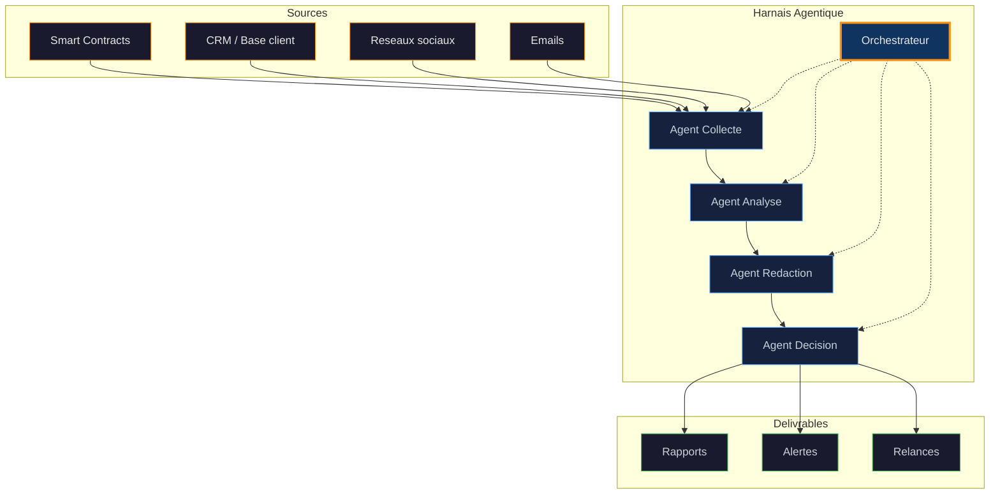

# Mermaid Architecture Diagram for HermesDeck Lead Emails

Use this to visually explain the workflow agent + agentic harness architecture.

## Diagram (MMD format)

## Color Scheme

| Element | Class | Hex |
|---|---|---|
| Sources | source | #f7931a (orange) |
| Agents | agent | #58a6ff (blue) |
| Orchestrator | orchestrator | #f7931a bold (orange) |
| Outputs | output | #3fb950 (green) |
| Background | subgraph | #0d1117 |

## Rendering

The .mmd file can be rendered using any Mermaid-compatible viewer
(mermaid.live, GitHub markdown, etc.). Include the rendered version
as an SVG attachment in the email.